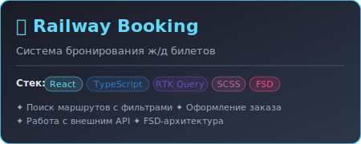
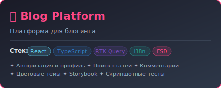
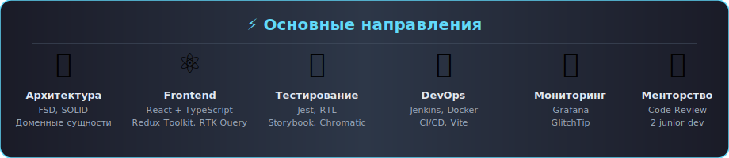

# 👋 Привет, я Никита!

 

## 🤝 Контакты

## 🚀 Обо мне

Я frontend-разработчик. Мой путь в IT начался в университете, но по-настоящему я погрузился в разработку, когда полностью посвятил себя самообучению. Сейчас строю масштабируемые SPA на React + TypeScript и развиваю продуктовые проекты в продуктовых командах.

## 🛠️ Мой подход к разработке

* 🏗️ Архитектура & Структура -- Feature-Sliced Design (FSD)
* 🛡️ TypeScript как основа
  * "as" и "any" - не наш выбор (почти);
  * Generic-типы;
* 🧪 Тестирование как культура
  * Unit-тесты (Jest) для функций;
  * Интеграционные тесты (React Testing Library);
  * Скриншотные тесты (Chromatic);
* ⚙️ Сборка под микроскопом
  * Vite и Webpack — конфиги на TypeScript;
  * модульность, а не один файл;
* 🚀 CI/CD и инфраструктура
  * Jenkins, Docker;
  * Husky + lint-staged для pre-commit гарантий;
* 📊 Мониторинг и наблюдаемость
  * Grafana для метрик;
  * GlitchTip для отслеживания ошибок;
* ✨ Чистый код — религия
  - DRY;
  - KISS;
  - SOLID для компонентов;
  - Автоматический линтинг (ESLint/Stylelint);
  - Форматирование — это важно (Prettier);

## 💼 Опыт работы

### 🏢 Noxer — Frontend-разработчик (октябрь 2024 — сейчас)
Коммерческий проект (админ-панель). С нуля выстроил архитектуру фронтенда по методологии Feature-Sliced Design, разработал кастомизируемый UI-кит и ключевые продуктовые механики — Process Validation и Change Tracker. Перевёл слой работы с API на Redux Toolkit Query, настроил инфраструктуру проекта (Vite, ESLint, Stylelint, Prettier, Husky, lint-staged), участвовал в настройке CI/CD на Jenkins и Docker. Внедрил юнит-тестирование на Jest + RTL и мониторинг через Grafana и GlitchTip. Курирую двух junior-разработчиков на код-ревью, участвую в планировании и проектировании общих доменных сущностей в связке с бэкендом.

### 🏦 Т-Банк — Ведущий разработчик (май 2023 — сейчас)
Развиваю голосового и чат-бота для инвестиций. Разрабатываю backend-фичи бота на Python и связку внутренних систем с API на JavaScript. Проектирую сценарии, пишу и интегрирую промпты с GPT, запускаю A/B-тесты гипотез. Веду техническую документацию, провожу тех-микрофоны. Работаю в agile: daily, спринты, планирования, Jira.

## 📚 Образование и курсы

### 🎓 Основное обучение
+ 2016-2019 | МТУ (МИРЭА) — Информационные системы и технологии (**неоконченное**)

### 🏅 Профессиональные курсы
- **Нетология**
  🎯 Профессия Frontend-разработчик (2025)
  📚 Алгоритмы и структуры данных (2025)

- **Result School**
  🔷 TypeScript (2024)

- **Курс от автора [Ulbi TV](https://www.youtube.com/@UlbiTV/videos)**
  ⚛️ Продвинутый Frontend (2024)

- **Udemy**
  💻 JavaScript

- **От 0 до 1**
  💻 Вёрстка

## 🛠️ Технологический стек

### Основные технологии:

### Сборка и инструменты:

### CI/CD и мониторинг:

### Дополнительно:

## 🏆 Ключевые pet-проекты

### 🚂 Система бронирования ж/д билетов

**Стек**: React • React Router • Redux Toolkit • RTK Query • TypeScript • SCSS • Chromatic • Storybook • Webpack • FSD

**Особенности**:
- Поиск маршрутов с фильтрами
- Заполнение формы
- Оформление заказа
- Работа с внешним API

### 📝 Платформа для блогинга

**Стек**: React • React Router • Redux Toolkit • RTK Query • TypeScript • SCSS • Chromatic • Storybook • i18n • Webpack • FSD

**Особенности**:
- Поиск статей
- Авторизация
- Редактирование профиля
- Добавление комментариев
- Работа с внешним API
- Несколько цветовых тем

## ⚡ Основные направления

